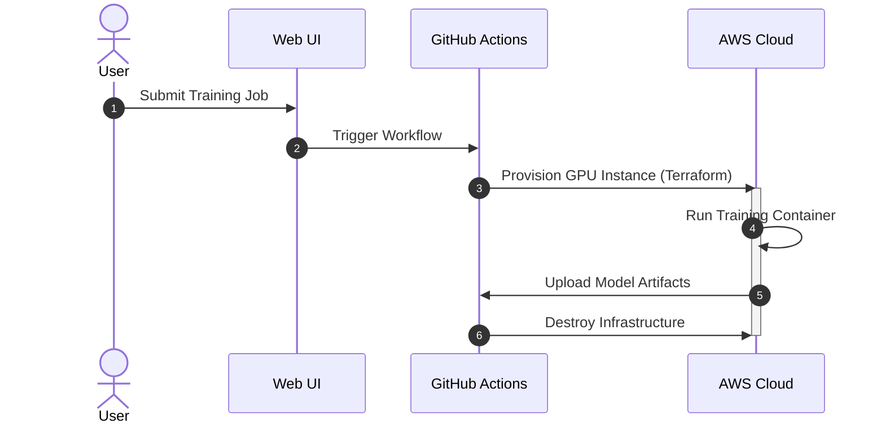
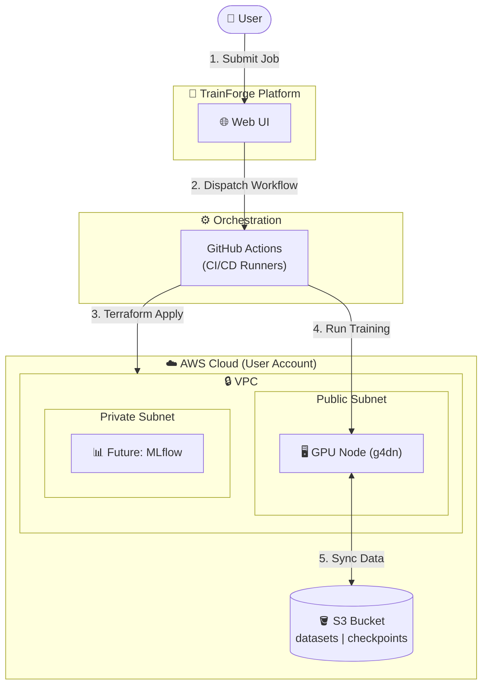

# TrainForge

Self-service ML training platform. Click a button, train on cloud GPUs using your own AWS account via GitHub Actions. No credential sharing required.

## ⚙️ How It Works



All compute happens in user's GitHub Actions + AWS account. TrainForge just orchestrates via GitHub API.

## 📊 Architecture



## 🔒 Security Model

- **Zero Trust**: TrainForge never sees AWS credentials (stored in GitHub Secrets)
- **Minimal Permissions**: GitHub App has minimal permissions (Contents + Actions write)
- **Data Sovereignty**: All compute runs in user's accounts
- **Privacy**: No code or data storage on TrainForge servers

## Features

- One-click training via GitHub Actions
- Runs on your AWS infrastructure (you control costs)
- GitHub App for workflow automation
- Terraform templates for different workloads (CPU/GPU)
- Web UI for job submission and monitoring
- Auto-cleanup after training completes

## Structure

```
trainforge/
├── web/
│   ├── frontend/          # Next.js UI
│   ├── backend/           # FastAPI + PostgreSQL
│   └── docker-compose.yml
├── k8s/                   # Kubernetes manifests
├── terraform/             # AWS infrastructure templates
│   ├── modules/           # Reusable modules
│   └── examples/          # Template configs (cpu-small, gpu-t4, etc)
└── docs/
```

## Quick Start

### For Users

1. Go to deployed TrainForge instance
2. Connect your GitHub repo (GitHub App install)
3. Add AWS credentials to repo secrets
4. Click "Train", select template, done

### For Developers

```bash
# Local dev
cd web
docker compose up

# Deploy to K8s
kubectl apply -f k8s/

# Create GitHub App, set credentials in k8s/secrets.yaml
```

## 💰 Cost Management

GPU instances can be expensive. Use these commands to manage costs:

```bash
# Stop the GPU instance when not in use
make stop-gpu

# Start it when you need to train
make start-gpu
```

The `g4dn.xlarge` instance costs approximately $0.526/hour on-demand.

# Run with local GPU (requires NVIDIA Docker runtime)

EPOCHS=2 make train

````

### Modifying the Model

Edit `docker/src/model.py` to change the neural network architecture, then rebuild:

```bash
make build
````

## Templates

| Template  | Specs           | Cost/hr | Use Case              |
| --------- | --------------- | ------- | --------------------- |
| cpu-small | 2 vCPU, 4GB     | ~$0.05  | Testing, small models |
| cpu-large | 8 vCPU, 32GB    | ~$0.20  | Data prep, CPU jobs   |
| gpu-t4    | T4, 16GB VRAM   | ~$0.75  | Most DL workloads     |
| gpu-a10   | A10G, 24GB VRAM | ~$1.50  | Large models          |

## Stack

**Frontend**: Next.js 16, Tailwind, shadcn/ui  
**Backend**: FastAPI, PostgreSQL, Alembic  
**Infra**: Kubernetes, Cloudflare Tunnel  
**Automation**: GitHub Actions, Terraform

## License

MIT
